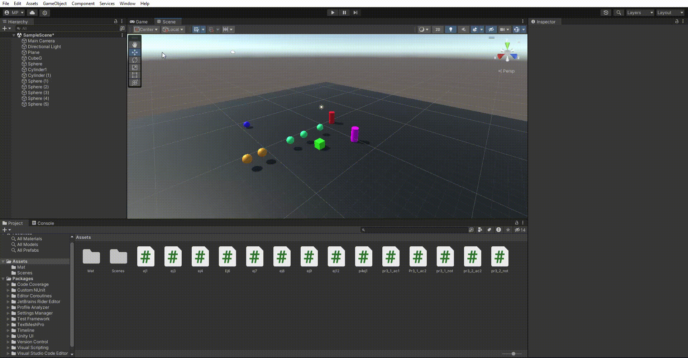
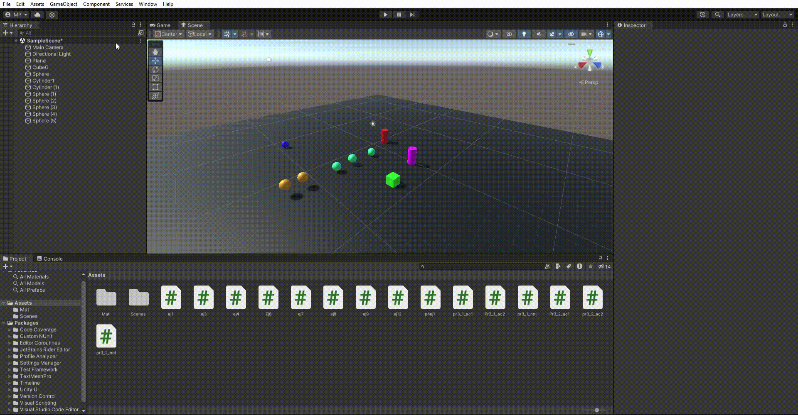
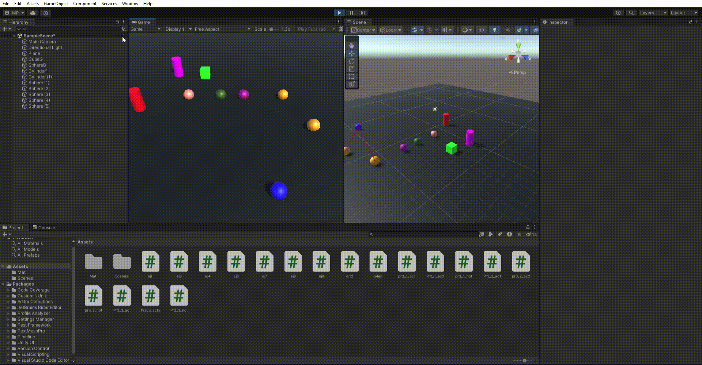
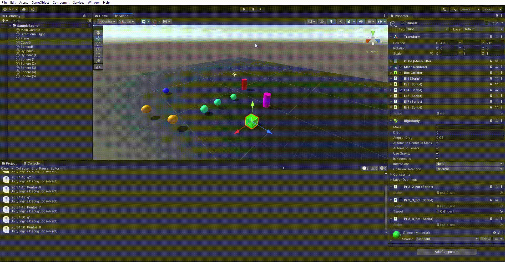
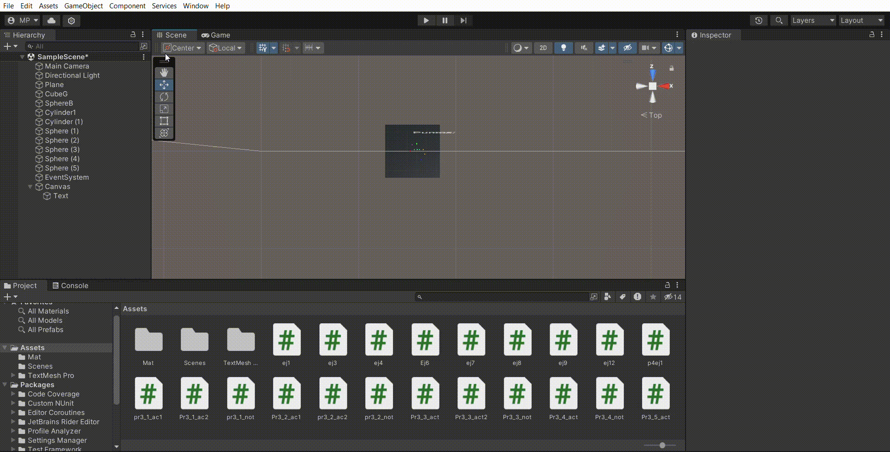

# Interfaces-Inteligentes-Peventos
Ejercicios de la práctica 3 de la asignatura de Interfaces Inteligentes

## Ejercicio 1
### Descripción
A partir de la escena que has estado utilizando en las últimas prácticas, crea la siguiente mecánica. Cuando el cubo colisiona con el cilindro, las esferas de tipo 1 cambian su color y las esferas de tipo 2 se desplazan hacia el cilindro.

### Resultado

Enlace scripts:
[Ejercicio 1 actuador 1](Scripts/pr3_1_ac.cs)
[Ejercicio 1 actuador 2](Scripts/pr3_1_ac1.cs)
[Ejercicio 1 notificador](Scripts/pr3_1_not.cs)

## Ejercicio 2
### Descripción
Adapta la escena anterior para que cuando el cubo colisiona con cualquier objeto que no sean esferas del grupo 1, las esferas en el grupo 1 se acercan al cilindro. Cuando el cubo toca cualquier esfera del grupo 1, las esferas del grupo 2 aumentan de
tamaño.

### Resultado

Enlace scripts:
[Ejercicio 2 actuador 1](Scripts/Pr3_2_ac1.cs)
[Ejercicio 2 actuador 2](Scripts/Pr3_2_ac2.cs)
[Ejercicio 2 notificador](Scripts/Pr3_2_not.cs)

## Ejercicio 3
### Descripción
Cuando el cubo se aproxima al cilindro, las esferas del grupo 1 cambian su color y saltan y las esferas del grupo 2 se orientan hacia un objeto ubicado en la escena con ese propósito.

### Resultado

Enlace scripts:
[Ejercicio 3 actuador 1](Scripts/Pr3_3_act.cs)
[Ejercicio 3 actuador 2](Scripts/Pr3_3_act2.cs)
[Ejercicio 3 notificador](Scripts/Pr3_3_not.cs)

## Ejercicio 4
### Descripción
Implementar la mecánica de recoger esferas en la escena que actualicen la puntuación del jugador. Las esferas de tipo 1 suman 5 puntos y las esferas de tipo 2 suman 10. Mostrar la puntuación en la consola.

### Resultado

Enlace scripts:
[Ejercicio 4 actuador ](Scripts/Pr3_4_act.cs)
[Ejercicio 4 notificador](Scripts/Pr3_4_not.cs)

## Ejercicio 5
### Descripción
Partiendo del script anterior crea una interfaz que muestre la puntuación que va obteniendo el cubo.

### Resultado

Enlace script: [Ejercicio 5](Scripts/Pr3_5_act.cs)